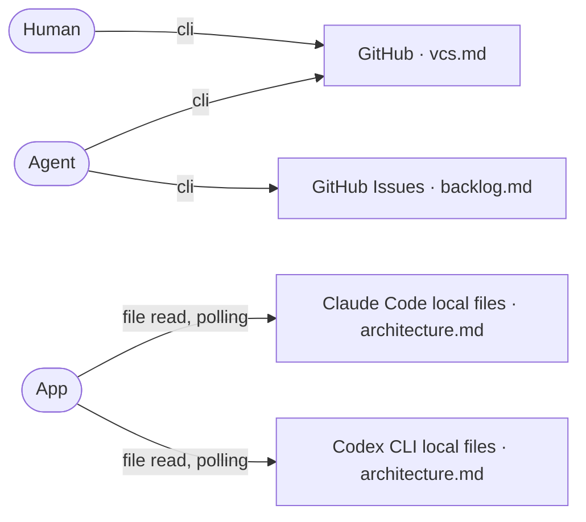

# Ecosystem

```mermaid
flowchart LR
  Human([Human])
  Agent([Agent])
  App([App])
  Vcs["GitHub · vcs.md"]
  Tracker["GitHub Issues · backlog.md"]
  Claude["Claude Code local files · architecture.md"]
  Codex["Codex CLI local files · architecture.md"]

  Human -- cli --> Vcs
  Agent -- cli --> Vcs
  Agent -- cli --> Tracker
  App -- "file read, polling" --> Claude
  App -- "file read, polling" --> Codex
```
